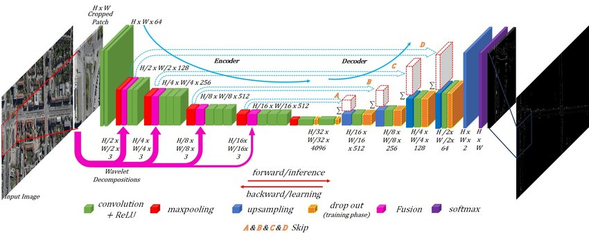

# LaneNet_Keras


Implementation of LaneNet Keras based on the paper FusionNet:[Aerial LaneNet: Lane Marking Semantic
Segmentation in Aerial Imagery using
Wavelet-Enhanced Cost-sensitive Symmetric Fully
Convolutional Neural Networks](https://arxiv.org/pdf/1803.06904.pdf)

## Requirements

* Python 3.6
* Keras > 2.0
* OpenCV

## Aerial Image


## Architecture





## Trainig model:
```
usage: train.py [-h] [--num_epochs NUM_EPOCHS] [--save SAVE] [--gpu GPU]
                [--checkpoint CHECKPOINT] [--class_balancing CLASS_BALANCING]
                [--continue_training CONTINUE_TRAINING] [--dataset DATASET]
                [--batch_size BATCH_SIZE] [--one_hot_label ONE_HOT_LABEL]
                [--data_aug DATA_AUG] [--change CHANGE] [--height HEIGHT]
                [--width WIDTH] [--channels CHANNELS] [--model MODEL]

optional arguments:
  -h, --help            show this help message and exit
  --num_epochs NUM_EPOCHS
                        Number of epochs to train for
  --save SAVE           Interval for saving weights
  --gpu GPU             Choose GPU device to be used
  --checkpoint CHECKPOINT
                        Checkpoint folder.
  --class_balancing CLASS_BALANCING
                        Whether to use median frequency class weights to
                        balance the classes in the loss
  --continue_training CONTINUE_TRAINING
                        Whether to continue training from a checkpoint
  --dataset DATASET     Dataset you are using.
  --batch_size BATCH_SIZE
                        Number of images in each batch
  --one_hot_label ONE_HOT_LABEL
                        One hot label encoding
  --data_aug DATA_AUG   Use or not augmentation
  --change CHANGE       Double image 256, 512
  --height HEIGHT       Height of input image to network
  --width WIDTH         Width of input image to network
  --channels CHANNELS   Number of channels of input image to network
  --model MODEL         The model you are using. Currently supports:
                        fusionNet, fusionNet2, unet, fusionnet_atten, temp,
                        vgg_unet, fusionnet_ppl
